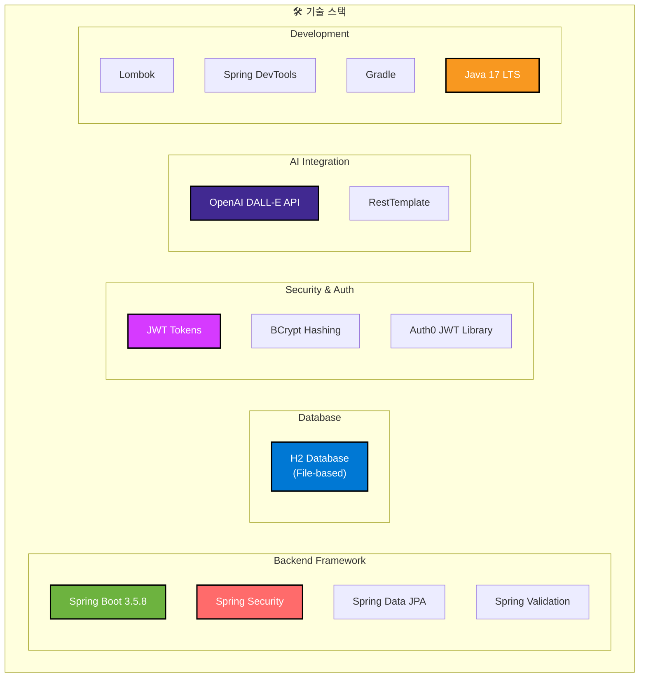
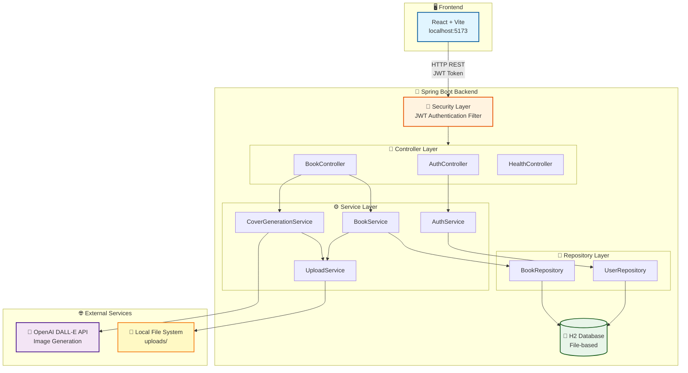
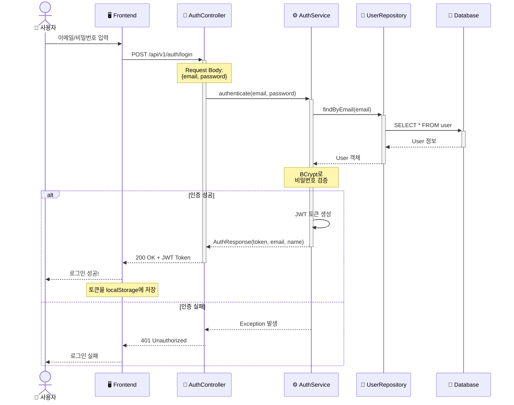
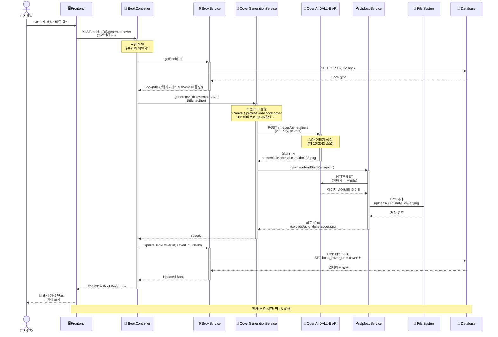
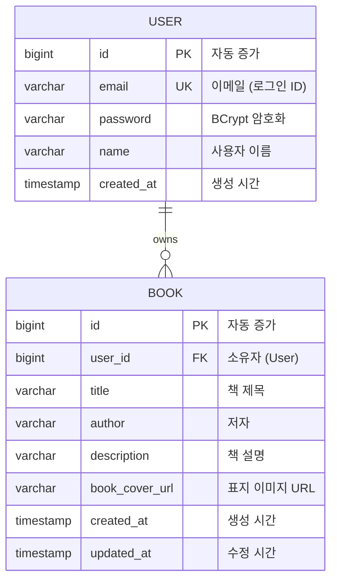
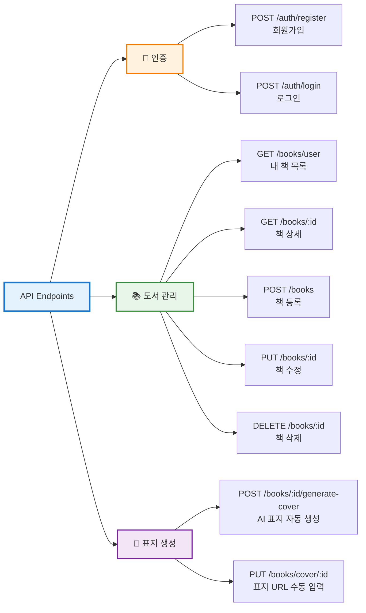
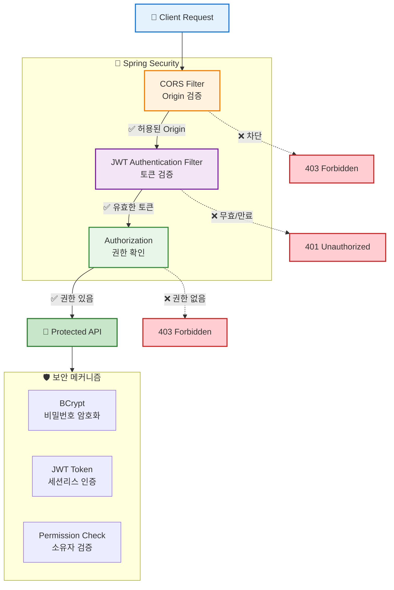

<div align="center">

# 📚 BMS Backend - Book Management System

### ✨ AI 기반 책 표지 자동 생성 기능을 갖춘 도서 관리 시스템 백엔드

[](https://spring.io/projects/spring-boot)
[](https://www.oracle.com/java/)
[](https://openai.com/)
[](https://www.h2database.com/)

[](LICENSE)
[](http://makeapullrequest.com)
[](https://hits.seeyoufarm.com)

[시작하기](#-시작하기) • [API 문서](#-api-문서) • [기술 스택](#-기술-스택) • [아키텍처](#-시스템-아키텍처)

</div>


---

## 📖 목차

- [프로젝트 소개](#-프로젝트-소개)
- [주요 기능](#-주요-기능)
- [기술 스택](#-기술-스택)
- [시스템 아키텍처](#-시스템-아키텍처)
- [프로젝트 구조](#-프로젝트-구조)
- [시작하기](#-시작하기)
- [API 문서](#-api-문서)
- [환경 설정](#-환경-설정)
- [개발 가이드](#-개발-가이드)

---

## 🎯 프로젝트 소개

BMS(Book Management System)는 사용자가 읽은 책을 효율적으로 관리하고, **OpenAI DALL-E API**를 활용하여 책 표지를 자동으로 생성할 수 있는 도서 관리 시스템입니다.

### 핵심 기능
- 🤖 **AI 기반 표지 생성** - DALL-E API로 책 표지 자동 생성
- 🔐 **JWT 인증** - 안전한 사용자 데이터 관리
- 📚 **도서 관리** - CRUD 기반 책 관리
- 📁 **파일 관리** - 이미지 업로드 및 저장

---

## ✨ 주요 기능

### 🔐 사용자 인증 및 관리
- 회원가입 / 로그인 (JWT 기반)
- 비밀번호 암호화 (BCrypt)
- 토큰 기반 세션리스 인증

### 📚 도서 관리 (CRUD)
- 책 등록, 조회, 수정, 삭제
- 사용자별 책 목록 관리
- 권한 기반 접근 제어

### 🎨 AI 표지 생성
- OpenAI DALL-E API 연동
- 책 제목 + 저자 기반 프롬프트 자동 생성
- 생성된 이미지 자동 다운로드 및 로컬 저장

### 📁 파일 관리
- 이미지 업로드 및 저장
- UUID 기반 파일명 생성
- 로컬 파일 시스템 관리

---

## 🛠 기술 스택



### Backend Framework
- **Spring Boot 3.5.8** - 애플리케이션 프레임워크
- **Spring Security** - 인증/인가
- **Spring Data JPA** - ORM 및 데이터베이스 접근
- **Spring Validation** - 입력 검증

### Database
- **H2 Database** - 경량 관계형 데이터베이스 (파일 기반)
  - 개발: 인메모리 모드
  - 운영: 파일 기반 영구 저장

### Security & Authentication
- **JWT (JSON Web Token)** - 토큰 기반 인증
- **Auth0 Java JWT 4.4.0** - JWT 라이브러리
- **BCrypt** - 비밀번호 암호화

### AI & Integration
- **OpenAI DALL-E API** - AI 이미지 생성
- **RestTemplate** - HTTP 클라이언트

### Development Tools
- **Lombok** - 보일러플레이트 코드 감소
- **Spring DevTools** - 개발 생산성 향상
- **Gradle** - 빌드 도구

### Language & Runtime
- **Java 17** - LTS 버전

---

## 🏗 시스템 아키텍처

### 전체 구조도



### 인증 흐름



### 표지 생성 흐름



---

## 📁 프로젝트 구조

```
bms-BE/
├── src/
│   ├── main/
│   │   ├── java/com/BMS/backend/
│   │   │   ├── api/                    # REST API Controllers
│   │   │   │   ├── BookController.java
│   │   │   │   ├── AuthController.java
│   │   │   │   └── HealthController.java
│   │   │   │
│   │   │   ├── config/                 # 설정 클래스
│   │   │   │   ├── SecurityConfig.java      # Spring Security 설정
│   │   │   │   ├── JwtTokenProvider.java    # JWT 토큰 생성/검증
│   │   │   │   └── JwtAuthenticationFilter.java  # JWT 필터
│   │   │   │
│   │   │   ├── domain/                 # 엔티티 (Domain Model)
│   │   │   │   ├── Book.java
│   │   │   │   └── User.java
│   │   │   │
│   │   │   ├── dto/                    # Data Transfer Objects
│   │   │   │   ├── Auth/
│   │   │   │   │   ├── LoginRequest.java
│   │   │   │   │   ├── RegisterRequest.java
│   │   │   │   │   └── AuthResponse.java
│   │   │   │   └── Book/
│   │   │   │       ├── BookCreateRequest.java
│   │   │   │       ├── BookUpdateRequest.java
│   │   │   │       └── BookResponse.java
│   │   │   │
│   │   │   ├── exception/              # 예외 처리
│   │   │   │   ├── CustomException.java
│   │   │   │   ├── GlobalExceptionHandler.java
│   │   │   │   └── ApiResponse.java
│   │   │   │
│   │   │   ├── repository/             # JPA Repositories
│   │   │   │   ├── BookRepository.java
│   │   │   │   └── UserRepository.java
│   │   │   │
│   │   │   ├── service/                # 비즈니스 로직
│   │   │   │   ├── AuthService.java
│   │   │   │   ├── BookService.java
│   │   │   │   ├── CoverGenerationService.java  # DALL-E 연동
│   │   │   │   └── UploadService.java
│   │   │   │
│   │   │   └── BackendApplication.java # Main Application
│   │   │
│   │   └── resources/
│   │       ├── application.yml              # 기본 설정
│   │       └── application-dev.yml          # 개발 환경 설정
│   │
│   └── test/                           # 테스트 코드
│
├── data/                               # H2 Database 파일 (파일 기반)
├── uploads/                            # 업로드된 이미지 파일
├── build.gradle                        # Gradle 빌드 설정
└── README.md                           # 프로젝트 문서
```

### 레이어별 책임

| Layer | 책임 | 예시 |
|-------|------|------|
| **Controller** | HTTP 요청/응답 처리, 입력 검증 | `@RestController`, `@RequestMapping` |
| **Service** | 비즈니스 로직 처리, 트랜잭션 관리 | `@Service`, `@Transactional` |
| **Repository** | 데이터베이스 CRUD 작업 | `JpaRepository` |
| **Domain** | 엔티티 정의 및 비즈니스 규칙 | `@Entity`, `@Id` |
| **DTO** | 계층 간 데이터 전송 | Request/Response 객체 |
| **Config** | 애플리케이션 설정 | Security, JWT, CORS |

---

## 📊 데이터베이스 설계

### ERD (Entity Relationship Diagram)



### 주요 제약 조건

- **USER.email**: UNIQUE 제약 (중복 불가)
- **BOOK.user_id**: NOT NULL, Foreign Key (User.id)
- **BOOK 삭제 시**: 사용자 권한 확인 필수 (본인의 책만 삭제 가능)

---

## 🚀 시작하기

### 사전 요구사항

- **Java 17** 이상
- **Gradle** (또는 내장 Gradle Wrapper 사용)
- **OpenAI API Key** (표지 생성 기능 사용 시)

### 설치 및 실행

#### 1. 프로젝트 클론
```bash
git clone <repository-url>
cd bms-BE
```

#### 2. 환경 변수 설정
```bash
# Windows PowerShell
$env:OPENAI_API_KEY="sk-proj-your-api-key-here"

# Linux/Mac
export OPENAI_API_KEY="sk-proj-your-api-key-here"
```

또는 `application-dev.yml` 파일에 직접 입력:
```yaml
openai:
  api-key: sk-proj-your-api-key-here
```

#### 3. 애플리케이션 실행
```bash
# Windows
./gradlew.bat bootRun

# Linux/Mac
./gradlew bootRun
```

#### 4. 서버 확인
```bash
curl http://localhost:8080/health
# 응답: OK
```

---

## 📡 API 문서

### API 엔드포인트 요약



### Base URL
```
http://localhost:8080/api/v1
```

### 인증

#### 회원가입
```http
POST /api/v1/auth/register
Content-Type: application/json

{
  "name": "홍길동",
  "email": "user@example.com",
  "password": "password123"
}
```

#### 로그인
```http
POST /api/v1/auth/login
Content-Type: application/json

{
  "email": "user@example.com",
  "password": "password123"
}

Response:
{
  "token": "eyJhbGciOiJIUzI1NiIsInR5cCI6IkpXVCJ9...",
  "email": "user@example.com",
  "name": "홍길동"
}
```

### 도서 관리

#### 책 목록 조회 (내 책)
```http
GET /api/v1/books/user
Authorization: Bearer <JWT_TOKEN>

Response:
{
  "success": true,
  "data": [
    {
      "id": 1,
      "title": "해리포터와 마법사의 돌",
      "author": "J.K. 롤링",
      "description": "마법 세계의 모험",
      "bookCoverUrl": "/uploads/abc123_dalle_cover.png",
      "userId": 1
    }
  ]
}
```

#### 책 등록
```http
POST /api/v1/books
Authorization: Bearer <JWT_TOKEN>
Content-Type: application/json

{
  "title": "클린 코드",
  "author": "로버트 C. 마틴",
  "description": "애자일 소프트웨어 장인 정신"
}
```

#### 책 수정
```http
PUT /api/v1/books/{id}
Authorization: Bearer <JWT_TOKEN>
Content-Type: application/json

{
  "title": "클린 코드 (개정판)",
  "author": "로버트 C. 마틴",
  "description": "업데이트된 내용"
}
```

#### 책 삭제
```http
DELETE /api/v1/books/{id}
Authorization: Bearer <JWT_TOKEN>
```

### 표지 생성 (AI)

#### AI로 표지 자동 생성
```http
POST /api/v1/books/{id}/generate-cover
Authorization: Bearer <JWT_TOKEN>

Response:
{
  "success": true,
  "data": {
    "id": 1,
    "title": "클린 코드",
    "author": "로버트 C. 마틴",
    "bookCoverUrl": "/uploads/uuid_dalle_cover.png",
    ...
  }
}
```

**동작 과정**:
1. 책 제목과 저자를 기반으로 DALL-E 프롬프트 생성
2. OpenAI DALL-E API 호출
3. 생성된 이미지 자동 다운로드
4. 로컬 파일 시스템에 저장
5. DB에 로컬 경로 업데이트

#### 표지 URL 수동 업데이트
```http
PUT /api/v1/books/cover/{id}
Authorization: Bearer <JWT_TOKEN>
Content-Type: application/json

{
  "coverImageUrl": "https://example.com/cover.jpg"
}
```

---

## ⚙️ 환경 설정

### application-dev.yml

```yaml
spring:
  # H2 Database 설정 (파일 기반)
  datasource:
    url: jdbc:h2:file:./data/bmsdb;AUTO_SERVER=TRUE
    driver-class-name: org.h2.Driver
    username: sa
    password: 1234

  # H2 Console
  h2:
    console:
      enabled: true
      path: /h2-console

  # JPA 설정
  jpa:
    hibernate:
      ddl-auto: update  # 테이블 자동 생성/업데이트
    show-sql: true      # SQL 로그 출력

# 서버 포트
server:
  port: 8080

# JWT 설정
app:
  jwtSecret: your-secret-key-here
  jwtExpirationInMs: 3600000  # 1시간

# OpenAI API
openai:
  api-key: ${OPENAI_API_KEY:your-api-key-here}
  model: dall-e-3
  image-size: 1024x1024

# 파일 업로드
file:
  upload-dir: uploads/
```

### 환경별 프로필

- `dev` - 개발 환경 (H2 파일 DB, SQL 로깅 활성화)
- `prod` - 운영 환경 (MySQL/PostgreSQL 권장)

실행 시 프로필 지정:
```bash
./gradlew bootRun --args='--spring.profiles.active=dev'
```

---

## 🔒 보안

### 보안 레이어 구조



### JWT 토큰 구조
```
Header: { "alg": "HS256", "typ": "JWT" }
Payload: { "sub": "user@example.com", "exp": 1234567890 }
Signature: HMACSHA256(base64(header) + "." + base64(payload), secret)
```

### 비밀번호 암호화
- **BCrypt** 해싱 알고리즘 사용
- Salt 자동 생성으로 Rainbow Table 공격 방어

### CORS 설정
```java
// 허용된 Origin
allowedOrigins: http://localhost:5173

// 허용된 메서드
allowedMethods: GET, POST, PUT, DELETE, OPTIONS

// 인증 정보 포함
allowCredentials: true
```

### API 키 관리
- OpenAI API 키는 **환경변수** 또는 **설정 파일**에 저장
- 프론트엔드에 **절대 노출 금지**
- 모든 DALL-E API 호출은 **백엔드에서만** 수행

---

## 👨‍💻 개발 가이드

### 새로운 엔티티 추가

1. **Domain 클래스 생성**
```java
@Entity
@Getter @Setter
public class Review {
    @Id @GeneratedValue
    private Long id;

    private String content;

    @ManyToOne
    private Book book;
}
```

2. **Repository 생성**
```java
public interface ReviewRepository extends JpaRepository<Review, Long> {
    List<Review> findByBookId(Long bookId);
}
```

3. **Service 구현**
```java
@Service
@RequiredArgsConstructor
public class ReviewService {
    private final ReviewRepository reviewRepository;

    public List<Review> getReviewsByBook(Long bookId) {
        return reviewRepository.findByBookId(bookId);
    }
}
```

4. **Controller 작성**
```java
@RestController
@RequestMapping("/api/v1/reviews")
public class ReviewController {
    private final ReviewService reviewService;

    @GetMapping("/book/{bookId}")
    public List<Review> getReviews(@PathVariable Long bookId) {
        return reviewService.getReviewsByBook(bookId);
    }
}
```

### 코드 컨벤션

- **클래스명**: PascalCase (`BookService`, `UserRepository`)
- **메서드명**: camelCase (`createBook`, `findByEmail`)
- **상수**: UPPER_SNAKE_CASE (`MAX_FILE_SIZE`)
- **패키지명**: lowercase (`com.bms.backend.service`)

### Git 커밋 메시지

```
feat: 새로운 기능 추가
fix: 버그 수정
docs: 문서 수정
refactor: 코드 리팩토링
test: 테스트 코드 추가
chore: 빌드 설정 변경
```

---

## 🧪 테스트

### 단위 테스트 실행
```bash
./gradlew test
```

### H2 Console 접속
1. 브라우저에서 `http://localhost:8080/h2-console` 접속
2. JDBC URL: `jdbc:h2:file:./data/bmsdb`
3. Username: `sa`
4. Password: `1234`

---

## 🐛 트러블슈팅

### CORS 에러
- `SecurityConfig`에서 CORS 설정 확인
- 프론트엔드 URL이 `allowedOrigins`에 포함되었는지 확인

### JWT 토큰 만료
- 로그인 후 새 토큰 발급
- `jwtExpirationInMs` 값 조정 (application-dev.yml)

### DALL-E API 오류
- OpenAI API 키 확인
- API 사용량 제한 확인
- 요청 간격 조절

### 데이터베이스 연결 실패
- H2 데이터베이스 파일 경로 확인
- `data/` 폴더 권한 확인

---

## 🤝 기여

1. Fork the Project
2. Create your Feature Branch (`git checkout -b feature/AmazingFeature`)
3. Commit your Changes (`git commit -m 'feat: Add some AmazingFeature'`)
4. Push to the Branch (`git push origin feature/AmazingFeature`)
5. Open a Pull Request
